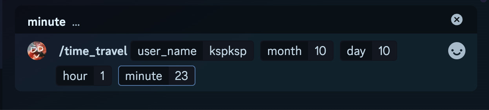

# DDV

> The published version of DDV.

## 專案介紹

這專案算是我用來複習多年沒碰的 Python，以及嘗試利用 AI 幫助我學習以前沒用過的東西，例如使用 Discord API 以及 Twitch API。下定決心把專案完成，靠的是當初在心中默默獻祭的約束力，畢竟主推們說到做到，身為粉絲當然也不能食言而肥。

開發 DDV 各種功能的動機是為了方便自己當個補檔 DD。命名靈感來自我最愛的女團「煌Sir有汐」歌詞：知道你們沒看 DVD 但很會 DDV。

*聲明：開發/學習過程中有利用 AI 輔助撰寫，在迭代過程中逐漸把結構與部分細節用我自己的方式重寫一次，讓它真正變成我學習、理解、消化後的樣子。*

### Todos

#### 功能加強
- [ ] 加強 VOD 回查: 
  - [x] 目前想法先給當下 VOD
  - [ ] 底下新增兩三個按鈕 ↺往回1分鐘 ↺往回30秒 ↺往回10秒 這些選項
  - [ ] UX: 脈絡加強 引用點選的原文 這樣如果查了很多條 就比較不會忘記想看的目標是甚麼  
- [ ] 修改成不用手動輸入完整 Twitch user name
- [ ] select stream 功能加強: 分類
  - [x] 新增數名非子午旗下藝人
  - [ ] Can I get list from the user?
  - [ ] DropList->DropList? just like folders
- [ ] /new 說明更新內容用
- [x] 新增 context menu
   - [x] 目前想像:右鍵->選其他->droplist->get VOD

#### 擴充支援
- [ ] youtube 支援
- [ ] DD helper: 手機無法一口氣跟兩個台。那我的網頁可以同時播兩個vod吧

#### 擴充功能
- [ ] 方便備份: VOD link 一鍵複製
- [ ] 方便備份: 生成指定時間範圍內的 VOD 連結，一鍵複製 VOD Title
- [ ] 方便備份: 備份 check list
- [ ] arduino 一鍵WIRELESS做標記

#### 已完成
- [x] select stream 美化
- [x] 機器人權限調整
- [x] 功能：/demo 說明
- [x] ~~Reply or Repost for the bot to get link~~ 改成右鍵了
- [x] 對訊息右鍵-->機器人查詢
- [x] 新功能公告機制:之後可用專屬 DC SERVER OR STATUS 

### Commands

1. /time_travel: 需要手動輸入實況主的 ID
   1. 以 Seki 為例，user_name 欄位要輸入她 twitch 帳號也就是 seki_meridian
      
   2. 接著輸入想查詢的時間點，年份已經預設為今年2024，只需手動輸入日期與時間。這裡則以 KSP 為例，假設想查詢的時間點為 10/10 01:23
      

2. /select_stream: 選擇指令並送出即可，不必另外輸入任何東西。
   1. 機器人會回覆一個下拉式選單，可以選擇想查詢的實況主/Vtuber，機器人會查出他/她最近的三則 VOD
      
      

3. /demo: 選擇指令並送出即可
   1. 機器人會介紹目前所有的功能以及如何使用
   2. 新增的項目後面會有 :new: 標示
   
4. /new: 還沒寫 但我想用這個來做 update log

### Roadmap

1. 讓使用者自行決定追蹤清單（可以考慮抓取該使用者本人的 Twitch follow
   1. 追蹤帳號的代表色如何抓取
   2. 追蹤帳號的代稱可以怎麼設定
2. 抓取 VOD 聊天室
   1. 打死不放過任何互動
3. KSeki 特別版指令: 
   1. 還沒想好，也許是專門擷取兩人在對方聊天室的留言，並且做成圖片。靈感來自 CodeSnap
4. 多畫面 DD 重播網頁
   1. 動機：多人聯動時往往只能專心看一個人的視角，但事後補檔要同時播放多個VOD是有點難，所以打算簡單用一個 html 當載體，能夠把 VOD 內嵌進去然後同時播放就好。
   2. 評估：大概要用到 javascript，但我跟它不熟，應該會比較有難度
5. 簡便的 VOD 備份輔助器（yt 上傳+權限發佈在私人
   1. 動機：平常有自行備份 VOD 的習慣，僅供自己回味用，不開任何盈利。但我希望這個備份過程更加簡單。另外是看到歌回剪輯大手的頻道無故被 ban，覺得需要有方法讓頻道備份更方便，免得憾事一再發生。
   2. 評估：Youtube API 有 Python 的，理解起來應該比較快。但會需要把 Twitch API 抓出來的資料送過去（備份 VOD 時)
6. Chrome extension 夢想: twitch 分類器，想法來自youtube也有類似外掛程式
7. YT/VOD markdwon 時間軸
   1. 靈感來自 Logseq 對 yt 影片的支援，可以透過快速鍵隨時新增筆記項目
   2. 好像可以跟 BOT 連動:查詢當下留言 引用留言 建立 vod 的時間戳記 同一支 vod 在同一篇筆記上
   3. 又一個可以移植到工作上的功能...訪談時間戳記

### Related Badges

